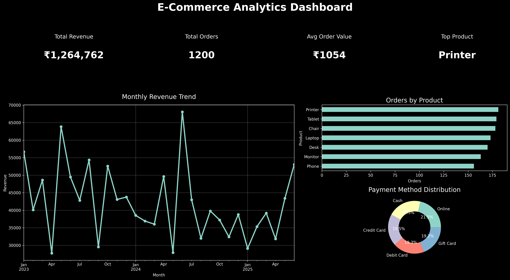

# 📊 E-Commerce Sales Data Analysis & Dashboard

## Dashboard Preview

<p align="center">
  
</p>

---

## 📌 Project Overview

This project focuses on Exploratory Data Analysis (EDA) of a cleaned E-Commerce Sales dataset containing 1,200 customer orders. The dataset was cleaned and validated during **Task 1 – Data Cleaning & Preparation** before being used for analysis and visualization.

The objective of this project is to identify sales patterns, customer purchasing behavior, product performance, payment preferences, and revenue trends. A professional Power BI–style dashboard was created using Python and Matplotlib to present key business insights.

---

## 🎯 Objectives

- Analyze sales and revenue trends
- Identify top-selling products
- Study customer payment preferences
- Evaluate monthly revenue performance
- Detect outliers in sales data
- Generate actionable business insights
- Build a professional analytics dashboard using Python

---

## 🔄 Data Analytics Workflow

Raw Dataset

⬇️

Task 1: Data Cleaning & Preparation

⬇️

Cleaned Dataset

⬇️

Task 2: Exploratory Data Analysis (EDA)

⬇️

Dashboard & Business Insights

This repository represents the second phase of the analytics workflow, where a cleaned dataset was analyzed to uncover trends, patterns, and business insights.

---

## 📂 Dataset Information

The dataset contains 1,200 records and 14 columns.

### Features

- OrderID
- Date
- CustomerID
- Product
- Quantity
- UnitPrice
- ShippingAddress
- PaymentMethod
- OrderStatus
- TrackingNumber
- ItemsInCart
- CouponCode
- ReferralSource
- TotalPrice

### Dataset Size

- Rows: 1200
- Columns: 14

### Dataset Source

The dataset used in this project is the cleaned dataset generated during **Task 1 – Data Cleaning & Preparation**.

---

## 🛠️ Technologies Used

- Python
- Pandas
- NumPy
- Matplotlib
- OpenPyXL
- VS Code
- Git
- GitHub

---

## 📈 Exploratory Data Analysis (EDA)

The following analyses were performed:

### Data Exploration

- Dataset inspection
- Data type analysis
- Dataset structure analysis
- Data validation checks

### Statistical Analysis

- Mean, Median, Standard Deviation
- Revenue distribution analysis
- Descriptive statistics

### Product Analysis

- Top-selling products
- Product order frequency analysis

### Revenue Analysis

- Total Revenue
- Average Order Value
- Monthly Revenue Trends

### Customer Behavior Analysis

- Payment Method Preferences
- Referral Source Analysis

### Outlier Detection

- Identification of unusual order values using the IQR method

---

## 📊 Dashboard Features

The dashboard provides:

✅ Total Revenue KPI

✅ Total Orders KPI

✅ Average Order Value KPI

✅ Top Product KPI

✅ Monthly Revenue Trend

✅ Product-wise Order Distribution

✅ Payment Method Distribution

✅ Professional Business Dashboard Layout

---

## 📌 Key Findings

| Metric              | Value         |
| ------------------- | ------------- |
| Total Revenue       | ₹1,264,761.96 |
| Total Orders        | 1200          |
| Average Order Value | ₹1053.97      |
| Top Product         | Printer       |

### Top Products

1. Printer
2. Tablet
3. Chair
4. Laptop
5. Desk

### Most Preferred Payment Method

- Online Payment

---

## 📁 Project Structure

```text
PROJECT_2_EDA
│
├── cleaned_dataset.xlsx
├── eda.py
├── dashboard.py
├── EDA_Report.docx
├── README.md
├── requirements.txt
├── .gitignore
│
├── graphs
│   ├── monthly_revenue.png
│   ├── payment_methods.png
│   ├── product_orders.png
│   ├── revenue_distribution.png
│   └── pro_dashboard.png
```

---

## 🚀 How to Run the Project

### Clone Repository

```bash
git clone <repository-link>
```

### Install Dependencies

```bash
pip install -r requirements.txt
```

### Required Dataset

Place the file:

```text
cleaned_dataset.xlsx
```

inside the project root directory.

### Run EDA Analysis

```bash
python eda.py
```

### Run Dashboard

```bash
python dashboard.py
```

---

## 📷 Generated Visualizations

The project generates the following visualizations:

- Monthly Revenue Trend
- Product Orders Analysis
- Payment Method Distribution
- Revenue Distribution Histogram
- Professional Analytics Dashboard

All visualizations are stored inside the **graphs** folder.

---

## 💡 Business Insights

- Revenue exceeded ₹1.26 Million across 1,200 orders.
- Printer emerged as the highest-selling product.
- Online payments were the most preferred payment method.
- Monthly revenue showed noticeable fluctuations indicating seasonal purchasing behavior.
- Average order value remained above ₹1,000, indicating healthy customer spending patterns.

---

## 🎯 Skills Demonstrated

- Data Cleaning Awareness
- Exploratory Data Analysis (EDA)
- Data Visualization
- Statistical Analysis
- Dashboard Development
- Business Insight Generation
- Python Programming
- Git & GitHub

---

## 👩‍💻 Author

**Anjali Neelam**

Aspiring Data Analyst | Python Enthusiast | Frontend Developer

**Skills**

- Python
- Pandas
- NumPy
- SQL
- HTML
- CSS
- JavaScript
- Data Analytics
- Data Visualization

**GitHub:** https://github.com/anjali112005

---

## ⭐ Project Outcome

This project demonstrates practical data analytics skills by transforming cleaned transactional data into meaningful business insights through statistical analysis, visualizations, and dashboard reporting.

It serves as a beginner-to-intermediate level Data Analytics portfolio project showcasing end-to-end Exploratory Data Analysis (EDA) and dashboard creation using Python.
